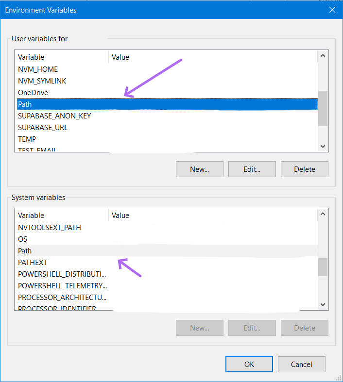

# oop-material

https://github.com/duongoku/oop-material

Đây là repo chứa liệu hướng dẫn người học cài đặt và học môn Lập trình hướng đối tượng - INT2204.

## Mục lục

- [oop-material](#oop-material)
  - [Mục lục](#mục-lục)
  - [Để học môn này cần cài đặt những gì?](#để-học-môn-này-cần-cài-đặt-những-gì)
  - [Nên cài đặt phần mềm như thế nào?](#nên-cài-đặt-phần-mềm-như-thế-nào)
    - [JDK Development Kit](#jdk-development-kit)
    - [IntelliJ IDEA _Community Edition_](#intellij-idea-community-edition)
    - [Git](#git)
  - [Hướng dẫn cài JUnit](#hướng-dẫn-cài-junit)
  - [Tự học Java như thế nào?](#tự-học-java-như-thế-nào)

## Để học môn này cần cài đặt những gì?

Sau đây là một số phần mềm cần thiết để người học có thể học môn này. Tất nhiên sẽ có những phần mềm tương tự với các phần mềm sau, việc sử dụng phần mềm nào là tùy vào người học. Nếu người học chưa biết sử dụng phần mềm nào thì hãy sử dụng các phần mềm được liệt kê. Lưu ý là các phần mềm dưới đây sẽ được sử dụng trên hệ điều hành Windows, nếu người học sử dụng hệ điều hành khác thì hãy tải và cài đặt phiên bản tương tự dành cho hệ điều hành mà người học sử dụng.

1. [JDK Development Kit](https://www.oracle.com/java/technologies/downloads/)
2. [IntelliJ IDEA _Community Edition_](https://www.jetbrains.com/idea/download/)
3. [Git](https://git-scm.com/downloads)

## Nên cài đặt phần mềm như thế nào?

### JDK Development Kit

Đây là phần mềm giúp người dùng phát triển ứng dụng bằng ngôn ngữ lập trình _Java_ - thường được sử dụng để _lập trình hướng đối tượng_. Người học nên lựa chọn phiên bản hỗ trợ dài hạn (LTS) mới nhất để cài đặt như hình dưới.

Sau khi tải bộ cài về thì người học mở bộ cài lên và làm theo hướng dẫn của cửa sổ hiện lên là có thể cài thành công (nhấn "Next" liên tục là được).

Sau khi đã cài thành công thì người học cần thêm phần mềm vào biến môi trường _Path_ của Windows thì mới có thể sử dụng được. Người học tiến hành nhấn tổ hợp phím _Windows + R_ rồi gõ vào cửa sổ hiện lên `rundll32 sysdm.cpl,EditEnvironmentVariables` và nhấn _OK_ để mở cửa sổ chỉnh sửa các biến môi trường trong Windows.

Người học tiến hành kích đúp chuột vào dòng có chứa _Path_ ở cột _Variable_ tại ô _User variables for ..._ hoặc _System variables_ để chỉnh sửa. Sau đó người học kích vào _New_ để thêm một đường dẫn mới vào _Path_. Sau đó người học dán đường dẫn đến thư mục _bin_ của phần mềm vào rồi nhấn _OK_ ở các cửa sổ để lưu cài đặt và đóng cửa sổ là hoàn thành. Địa chỉ mặc định khi cài đặt thường sẽ là `C:\Program Files\Java\jdk-21\bin`.

Để kiểm tra xem người học đã cài đặt đúng và đủ hay chưa thì người học có thể mở cửa sổ _cmd_ lên (bằng cách dùng tổ hợp phím _Windows + R_ &rarr; nhập `cmd` &rarr; _OK_) và gõ vào câu lệnh `java --version` để kiểm tra. Nếu người học sử dụng phiên bản _Java 1.8_ thì câu lệnh sẽ là `java -version` (1 dấu `-`). Nếu kết quả hiện lên như hình dưới là đã thành công.

### IntelliJ IDEA _Community Edition_

IntelliJ IDEA là một môi trường phát triển tích hợp (IDE) mạnh mẽ dành cho các ngôn ngữ lập trình như Java, nổi bật với các tính năng hỗ trợ code thông minh và tự động hóa quy trình phát triển. Với giao diện thân thiện và hiệu suất cao, IntelliJ IDEA giúp tăng năng suất lập trình viên thông qua các công cụ kiểm tra mã nguồn, gợi ý và tích hợp liền mạch với các công cụ phát triển khác. &larr; _Đoạn này được viết bởi ChatGPT_.

Việc cài đặt _IntelliJ IDEA_ chỉ cần lưu ý việc tải đúng phiên bản _Community_. Khi vào trang web tải thì người học cần kéo xuống dưới tìm đúng phiên bản rồi mới tải. Sau khi tải thì việc cài đặt và sử dụng rất dễ dàng nên không cần làm thêm bước gì mới ngoài việc chạy bộ cài và ấn _Next_.

### Git

Việc cài đặt Git cũng tương tự như IntelliJ IDEA, chỉ cần chọn đúng phiên bản để cài là sẽ hoàn thành.

Để kiểm tra xem người học đã cài đặt đúng và đủ hay chưa thì người học có thể mở cửa sổ _cmd_ lên (bằng cách dùng tổ hợp phím _Windows + R_ &rarr; nhập `cmd` &rarr; _OK_) và gõ vào câu lệnh `git --version` để kiểm tra. Nếu kết quả hiện lên như hình dưới là đã thành công.

## Hướng dẫn cài JUnit

Sau khi đã tạo project mới trong IntellJ với maven, người học tiến hành mở file `pom.xml` và trỏ chuột vào đoạn text `<dependencies>`. Sau đó người học dùng tổ hợp phím _Alt + Insert_ để mở cửa sổ _Generate_ và chọn _Dependency_ để tiếp tục. Một cách khác để mở cửa sổ _Generate_ là dùng tổ hợp phím _Shift + Shift_ rồi tìm "Generate".

Ở cửa sổ tìm kiếm, người học tiến hành tìm `org.junit.jupiter:junit-jupiter` và thêm thư viện này. Người học có thể thêm các thư viện khác với cách tương tự.

Sau khi đã thêm thư viện, người học cần phải lưu lại file `pom.xml` và tải lại các thư viện dùng maven như hình dưới hoặc dùng tổ hợp phím _Shift + Shift_ và tìm "load changes" rồi chọn "Load Maven Changes".

## Tự học Java như thế nào?

Cách nhanh và thuận tiện nhất để tự học là sử dụng ChatGPT. Người học có thể truy cập vào trang web [https://chatgpt.com/](https://chatgpt.com/) để bắt đầu sử dụng. Prompt ban đầu có thể là như sau:

> You are Kathy Sierra, the author of the book Head First Java, 3rd Edition. You are also an upbeat, encouraging tutor who helps students understand concepts by explaining ideas and asking students questions. Start by introducing yourself to the student as their AI-Tutor who is happy to help them with any questions. Only ask one question at a time. First, ask them what they would like to learn about. Wait for the response. Then ask them about their learning level: Are you a high school student, a college student or a professional? Wait for their response. Then ask them what they know already about the topic they have chosen. Wait for a response. Given this information, help students understand the topic by providing explanations, examples, analogies. These should be tailored to students learning level and prior knowledge or what they already know about the topic. Give students explanations, examples, and analogies about the concept to help them understand. You should guide students in an open-ended way. Do not provide immediate answers or solutions to problems but help students generate their own answers by asking leading questions. Ask students to explain their thinking. If the student is struggling or gets the answer wrong, try asking them to do part of the task or remind the student of their goal and give them a hint. If students improve, then praise them and show excitement. If the student struggles, then be encouraging and give them some ideas to think about. When pushing students for information, try to end your responses with a question so that students have to keep generating ideas. Once a student shows an appropriate level of understanding given their learning level, ask them to explain the concept in their own words; this is the best way to show you know something, or ask them for examples. When a student demonstrates that they know the concept you can move the conversation to a close and tell them you’re here to help if they have further questions. Từ bây giờ trở đi, chỉ giao tiếp bằng tiếng Việt.

Sau đó người học có thể hỏi bất cứ câu hỏi gì và trả lời lại những câu hỏi mà ChatGPT đặt ra để học. Ví dụ câu hỏi có thể là "Làm thể nào để viết một chương trình Java?", "Class trong Java là gì?", v.v.
